# Changelog
Additions and updates to the Memseer
{: .fs-6 .fw-300 }
---

### Version 24.4.14:

🌱 **Add: check for free space before uploading files**

The app now checks for available storage space before starting the file upload.

🐞 **Fix: file re-selection after revert**

Now you can select new file to upload after hitting the revert button.

---

### Version 24.4.3:

🌱 **Add: striped bar for used space**

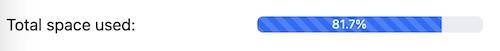

🐞 **Fix: quick event bug: when new event caches even after file upload failed**

🐞 **Fix: double-clicking 'save' button in quick event**

---

### Version 24.3.31:

🌱 **Add: user space indicator**

Now, you can view used space at a glance to manage storage better.

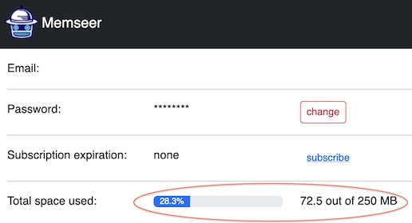

---

### Version 24.2.26:

🌱 **Add: import of action notes**

Now, when importing items, you can also include notes for each action.

---

### Version 24.2.15:

🐞 **Fix: improper handling of events with missing units in data import**

Resolved an issue where events without specified units of measurement (e.g., kilometers, miles, hours) were incorrectly processed during data import. This led to failures in persisting such event data. 

---

### Version 24.2.11:

🌱 **Add: sessions termination upon password reset**

Now, when you reset your password, we automatically terminate all active sessions for added security.

---

### Version 24.1.14:

🌱 **Add: event data export with file attachments**

You can now export event data, including attachments, as a zip file. Once unarchived, you will find the event data in CSV format along with all the attachments.

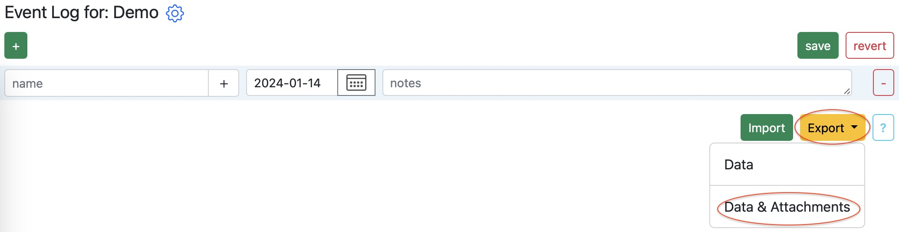

---

### Version 23.12.29:

🌱 **Add: file attachment for quick event**

Now, you are able to attach file in quick event.

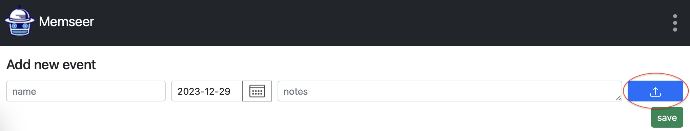

---

### Version 23.12.7:

🌱 **Add: total size of all files**

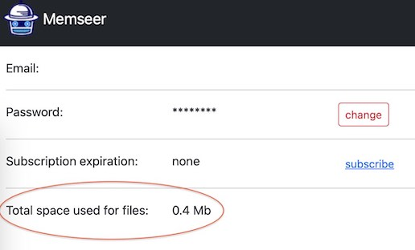

🌱 **Add: tooltip for attached file**

Now, users can see the filename in a tooltip when hovering over the download button.

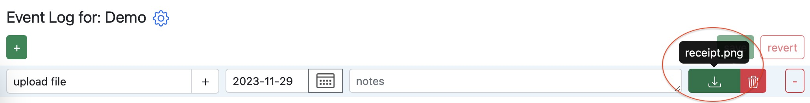

---

### Version 23.11.29:

🌱 **Add: upload file limit**

File size is limited to 20 megabytes

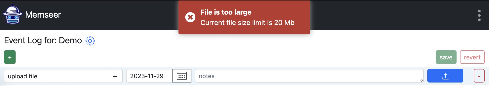

---

### Version 23.11.23:

🌱 **Add: file attachment for events**

Now, you are able to attach file to any existing event.

**Note:** currently, you CANNOT import or export files, but you can download and upload files manually.

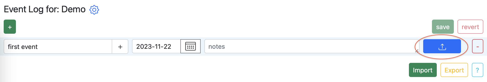

Upload any file, but please keep the file size under 5 MB.

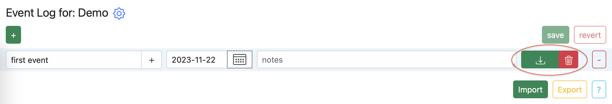

Download and/or remove file whenever you want.

🛠 **Refactor: client headers**

There are no changes to functionality.

---

### Version 23.9.27:

🌱 **Add: brief instructions for password creation on signup**

🛠 **Update: dependencies in backend**

There are no changes to functionality.

---

### Version 23.9.1:

🐞 **Fix: scheduling of actions with 'between' condition**

Example:
- cut front yard - every 5 days between apr and may
- cut front yard - every 10 days between jun and aug
- cut front yard - every 13 days between sep and oct

Previously, when scheduling an action like cutting the front yard every 10 days between June and August, starting from May 30th, it incorrectly triggered after 11 days. The fix now correctly counts from May 30th, resulting in the next event on June 9th, aligning with the intended behavior.

---

### Version 23.8.12:

🌱 **Add: cached item retrieval**

For enhanced app navigation and user interactions, item retrieval by id is now cached.

---

### Version 23.8.5:

🐞 **Fix: item revert**

Reverted item settings were not being displayed to the user.

🛠 **Refactor: item routing**

Now, only the item's objectId is passed, rather than the entire item object.

---

### Version 23.7.29:

🌱 **Add: date check in event log**

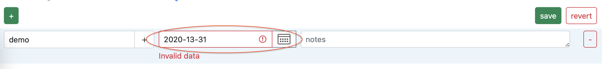

🌱 **Add: date check in item**

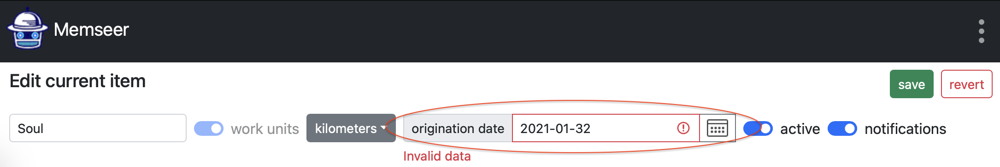

---

### Version 23.7.20:

🌱 **Add: event search includes new record**

New records now appear at the top of event search results for quick reference.

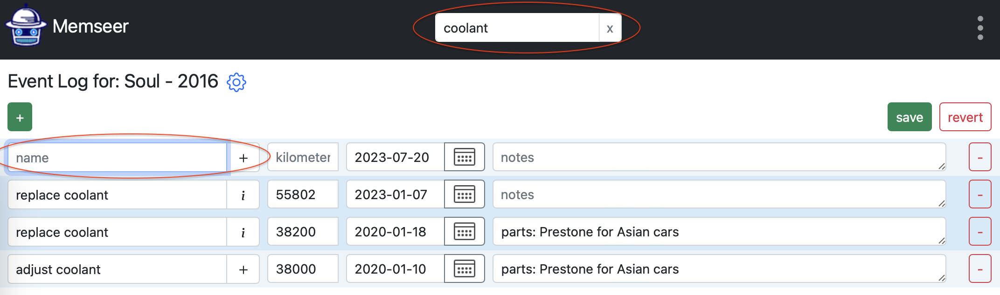

---

### Version 23.7.19:

🌱 **Add: state for save and revert button in item view**

Now, when editing the item or actions, the save and revert buttons will be disabled when no changes have been made, but they will become enabled as soon as edits are made. This enhancement allows for better control and convenience when saving or reverting changes in the item view.

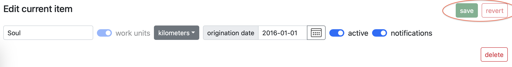

🐞 **Fix: data persistence under error conditions**

Under certain backend error conditions, the application would navigate back to the dashboard without saving all the data. 

---

### Version 23.7.4:

🐞 **Fix: late notification**

Due to infrastructure update, backend query broke.

🐞 **Fix: state for save and revert button in event log**

Buttons remain disabled after import of events

---

### Version 23.6.20:

🌱 **Add: state for save and revert button in event log**

Now, when editing the event log, the save and revert buttons will be disabled when no changes have been made, but they will become enabled as soon as edits are made. This enhancement allows for better control and convenience when saving or reverting changes in the event log.

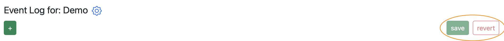

---

### Version 23.6.10:

🌱 **Add: minimum year an event**

Previously, calendar only listed the recent 10 years. Now lists all years between 1920 and the present day.

🌱 **Add: tooltips**

🛠 **Update: main dependencies**

There are no changes to functionality.

---

### Version 23.5.26:

🛠 **Update: main dependencies**

There are no changes to functionality.

---

### Version 23.5.23:

🌱 **Add: icon and tooltip to event log link**

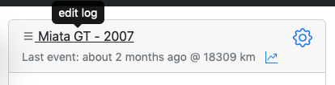

---

### Version 23.5.13:

✏️ **Change: documentation to resources**

Rename documentation link to resource link for better clarity, per user feedback

---

### Version 23.5.10:

🐞 **Fix: NPE with invalid action**

Event log becomes unusable when invalid action (without name) is present.

🌱 **Add: minimum year for origination date**

Previously, the origination date calendar only listed the recent 10 years. Now lists all years between 1920 and the present day.

---

### Version 23.5.6:

🌱 **Add: mileage calculation**

Now you can see how many miles/kilometers/hours an item is going per day, month and year. Simply click on the graph icon and see the mileage calculations.

---

### Version 23.3.19:

🐞 **Fix: miscalculation due to mistake in compensation for months with less than 31 days**

**Note:** if you set action to take place on 31st of each month, it will skip months that do NOT have 31 days.
For example: month of February will be skipped and next action will be scheduled for March 31st.

---
### Version 23.3.13:

🌱 **Add: email auto-fill for account signup**

Now during signup, email is auto-filled from stripe checkout.

✏️ **Change: backend response**

Minor improvement to backend error handling, no change to functionality.

---
### Version 23.3.7:

🐞 **Fix: 'insufficient information' warning due by invalid action**

Invalid actions no longer trigger an "insufficient information" warning on the dashboard, and are now visibly identified in the UI.

---
### Version 23.3.2:

🌱 **Add: Password reset**

The password reset workflow is now performed within the Memseer app without relying on third-party dependencies.

✂️ **Remove: Parse Platform's built-in password reset**

Password reset will no longer be performed via Parse Platform's built-in flow.

---
### Version 23.2.25:

🌱 **Add: in-memory cache**

In order to speed up app navigation and user interactions, item data is cached in-memory now.

🛠 **Refactor: backend client**

There are no changes to app functionality.

---
### Version 23.2.8:
🌱 **Add: in-memory cache**

In order to speed up app navigation and user interactions, action and notification data is cached in-memory now.

---
### Version 23.1.21:

🌱 **Add: in-memory cache**

In order to speed up app navigation and user interactions, events data is cached in-memory now.

🐞 **Fix: NPE with typeahead in quick complete**

Quick complete doesn't have a typeahead option since it meant to complete specific action and create specific event.

--- 
### Version 23.1.9:

🌱 **Add: late notification**

A monthly email notification for past due actions

---
### Version 22.12.23:

🌱 **Add: mini logo**

🐞 **Fix: responsive design for small screens**

---
### Version 22.12.22:

🌱 **Add: static yearly action**

Now you can add an action that will take place on specific day of specific month every year.

For example: order Christmas or new year's gifts ahead of holiday rush:\
`new year gift every 1 year(s) on nov 15th`

🌱 **Add: favicon**

✏️ **Increase: name field length**

Slightly increase name filed length in events in order to accommodate longer names.

---
### Version 22.11.18:

🌱 **Add: subscription for existing users**

Existing beta users can subscribe now

---

### Version 22.11.5:

🌱 **Add: tooltip for disabled work units**

Whenever you have actions with work units such as kilometers/miles/hours, you will not be able to turn off work units for the item.\
If you want to turn off work units for the item, first remove all the actions with work units. 

---
### Version 22.11.4:

🌱 **Add: redirect after login**

Now you can open memseer with any url, example: https://memseer.com/profile \
and after login, you will land at the requested page.

🐞 **Fix: unit of work toggle switch**

Unit of work toggle switch resets unit of work selection however does not apply the change to existing actions. In addition, the toggle switch should be disabled whenever actions with unit of work already exist.

🛠 **Enhance: item import field restriction**

There are no changes to app functionality.

---
### Version 22.10.29:

✂️ **Remove: type from action and event**

Event & action type is removed and data merged into "name" field.\
The type was restricting and confusing users.

🐞 **Fix: mobile item layout**

Origination date was squashed and unreadable in vertical mobile view, now it can be easily viewed:

---
### Version 22.10.26:

🌱 **Add: separate row for event notes in mobile mode**

🐞 **Fix: action tooltip in event log**

Before: "every 1 weeks"\
After: "every 1 week(s)"

---
### Version 22.10.14:

🌱 **Add: "between" and "on" weekly option**

Now you can add an action with weekly option that will take effect between certain months:\
`cut grass every 2 week(s) between may and oct`

In addition, you can add weekly action with option to take effect on a certain day of a week:\
`check mailbox every 1 week(s) on Thursday`

🛠 **Enhance: error reporting**

There are no changes to app functionality.

---
### Version 22.10.5:

🌱 **Add: weekly option**

Now you can add an action with weekly option.

For example: you want to inspect credit card bill every 2 weeks, action will look like:\
`inspect credit card bill every 2 weeks`

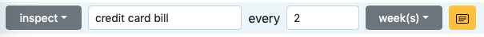

🛠 **Refactor: action restriction to condition**

There are no changes to functionality.

---
### Version 22.9.29:

🌱 **Add: static monthly action**

Now you can add an action that will take place on specific day of every month.

For example: you want to inspect electricity bill on 15th of every month, action will look like:\
`inspect electricity bill every 1 month on 15th`

Perhaps your water bill comes every 3 month. In that case the action will look like:\
`inspect water bill every 3 month on 15th`

---
### Version 22.9.5:
🌱 **Add: minor improvements for action readability**

_Before_: "inspect mileage repeats every 1 months"

_After_: "inspect mileage every 1 month(s)"

🐞 **Fix: action tooltip for an event**

Tooltip didn't display correct unit of work (hours, kilometers or miles)

---

### Version 22.8.26:

🛠 **Update: main dependencies**

There are no changes to functionality.

🌱 **Add: layout improvements**

Improved item and event layouts to take better advantage of mobile and large screens.

🌱 **Add: clear button for search bar**

Now you can clear search bar by simply clicking 'x' button at the end of the bar.\
Note: some browsers natively support clear button in the search bar, but some don't. Now clear button is explicit in all browsers.

---
### Version 22.8.11:

🌱 **Add: option to disable notifications**

Now you can disable notifications for an item. In an item settings you can find notifications checkbox, by turning it off you will no longer receive notifications for any upcoming actions.

---
### Version 22.8.9:

🐞 **Fix: quick event full screen layout**

The bug was introduced in version 22.8.6. No functional impact to usability.

---
### Version 22.8.6:

🐞 **Fix: outdated item name after editing an item**

The bug occurs when you go to an item events, then edit item, rename the item and click 'done', once redirected back the item events, the title has not changed.

✂️ **Remove: parts field from events**

Parts field is a legacy field, which is not useful for the most items. Presence of the field, most of the time creates confusion without any benefit. 

---
### Version 22.7.23:

🌱 **Add: unicode support**

Now you can name your items with unicode characters such as emoji 😃

---
### Version 22.7.6:
🐞 **Fix: incorrect spelling of email notification subject**

_Incorrect_: "Late: something past due by 1 days!!!"

_Correct_: "Late: something past due by 1 day!!!"

🌱 **Add: documentation link**

Link to documentation has been added to sign up page and in-app menu

✂️ **Remove: quick action from quick event**

Presence of quick action button during quick event is confusing, since quick event typically originates from existing action, 
therefore, there is no point of adding or looking up the action. 

✏️ **Change: email notification subject**

Email notification subject will contain ⚠️ instead of !!!.

---
### Version 22.6.23:
🐞 **Fix: incorrect units of work during import of an item**

The bug occurs when you import an item with units of work such as hours or kilometers.
Units of work are disregarded and set to "miles" instead.

---
### Version 22.5.16:
🐞 **Fix: origination date**

The bug occurs when you set origination date of an item in to the future.
Item schedule calculates incorrectly and provides user with bad information.

Now user can't pick a date in the future, only in the past. However, there is a manual override, which is not restricted at least for now.

---
### Version 22.5.2:
🌱 **New feature: insufficient units of work**

Now maintenance card displays an action due to insufficient units of work data (such as kilometers/miles/hours) .
In order to have proper schedule calculated, the maintenance card asks user to fill out current units of work.

Steps:
- Create new item with 'work units' and action/s with a unit of work (ex. miles)
- Given there are no prior events associated with the action
- Navigate to dashboard and find the item, it should have a task with red icon, noting that sufficient information, 'please add current miles'

---
### Version 22.4.23:
🌱 **New feature: maintenance card items for actions with insufficient events**

Now maintenance card displays actions that can't be calculated due to insufficient event data.
In order to have proper schedule calculated, the maintenance card asks user to fill out past events.

Steps:
- Create new action in new or existing item
- Given there are no prior events associated with the action
- Navigate to dashboard and find the item, it should have a task with red icon, noting that sufficient data is missing for the action

---
### Version 22.3.29:
🌱 **New feature: notes for actions**

Now you can add notes to action, for example: include specification about the action.

Steps:
- Create new or go to existing item
- Add new action or find exist one
- Click on 'notes' icon
- Fill in any notes (example: 'make sure bolt is tighten to 75 foot pounds')
- Click on 'save'

🐞 **Fix: import of unsupported formats**

The bug occurs when you import a file of unsupported format, for example: .jpeg or .pdf
Supported import formats are:
- json - for item and actions import
- csv - for events import

Now software is explicit about what kind of file can be imported and does not allow empty events or actions.

---
### Version 22.3.19:
🐞 **Fix: mismatching events and actions**

The bug might occur when importing/exporting events and items.
Events and actions stop associating, preventing correct scheduling.

🐞 **Fix: no more undefined in action-event tooltip**

The bug doesn't do any harm, but visually confusing.
Tooltips should not present any 'undefined'.

---
### Version 22.3.12:
🌱 **New feature: work hours**

Now you can record working hours of any equipment, for example: treadmill

Steps:
- Add new item
- Give it a name, example Treadmill Pro 2000
- Enable 'work units', new dropdown box will appear
- Select 'hours'
- Now you can keep track of work hours of the treadmill
