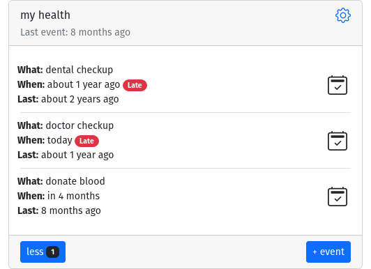

# Health

Health is one of the most precious things we got. We tend to not think of it when everything is well, but it is all we can think of, otherwise. Life is busy,
we all get carried away and not every health provider remembers to get a hold of you for annual (or semiannual) checkup. Let’s take charge of it and setup
yearly checkup with doctor, dentist and perhaps a blood donation.

Navigate to [memseer.com](https://memseer.com){:target="_blank"}

Enter your email and password and complete sign in. 

Add new item and name it “my health”, you can add your own birthday (if you want). Let’s add following actions:

* doctor checkup every 1 year
* dental checkup every 1 year
* donate blood every 1 year

Click “done” and new item is happy to report that some additional information is needed.

It needs to know when was the last time you had checkups. Click red link, set the date of the last time you did checkup and click “save”. 
Repeat this step two more times, and now you can track when was the last time you did checkups and/or when you should schedule (or expect) to have next one.

