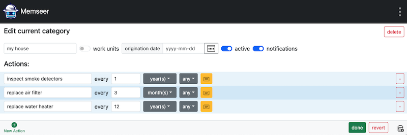

# House

Owning a home means keeping up with a basic level of maintenance. Every few months, the air filter needs to be replaced. Once a year, check your smoke and carbon-monoxide detectors. About every 12 years, plan to replace the water heater, and every 15–20 years, the roof shingles may need attention. No one enjoys waking up to a cold shower or discovering water dripping from the ceiling. So let’s create a “House” item and assign a few actions to it to stay ahead of these tasks.

Navigate to [memseer.com](https://memseer.com){:target="_blank"}

Enter your email and password and complete sign in.

You will be redirected to the main dashboard. In the bottom left corner click on "New Category". 
Add new category, name it, click on New Action and add the following actions:

* Replace air filter every 3 months
* Inspect smoke detectors every 1 year
* Replace water heater every 12 years

You can add as many actions as you want but for this example, lets leave it at those.

Click “done” and you will next land on the dashboard with a new category called “my house” which needs some attention. The system needs to know when was the last time you performed those actions in order to calculate a schedule for the future. Let’s fill out that information.

Click on red icon next to “replace air filter” and change current date to the date when air filter got replaced last time. If you don’t remember, it is ok, just approximate. Now click “save” and you will be back to the dashboard. Fill out the rest of the missing information for “inspect smoke detectors” and “replace water heater”.

Now that everything is populated, you can see “my house” on the dashboard with information on each particular action: what is the action, when it should occur
and last time the event took place. Everything is at the palm of your hand. Enjoy!

