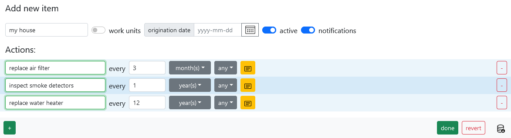
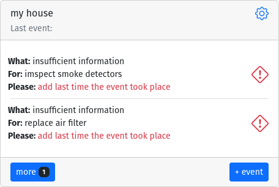
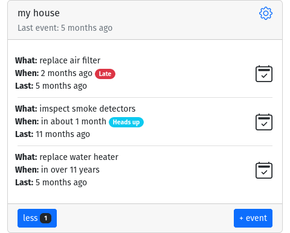

# House

You have a house, and it requires some minimum level of maintenance. Every few month air filter needs to be replaced. Do you need to inspect smoke and fire
detectors once per year? Every 12 years or so water tank needs to be replaced and perhaps every 15-20 years shingles on the roof should be replaced. No one
enjoys waking up one morning without hot water or water dripping from a top. So lets create a house item and set few actions to it.

Navigate to [memseer.com](https://memseer.com){:target="_blank"}

Enter your email and password and complete sign in.

Add new item, name it and add following actions:

* Replace air filter every 3 months
* Inspect smoke detectors every 1 years
* Replace water heater every 12 years

You can add as many actions as you want but for the example lets leave it at those.

Click “done” and you will be landed to dashboard with “my house” needing some attention. It needs to know when last time you performed those actions in order to
calculate schedule for the future. Let’s fill out that information.

Click on red icon next to “replace air filter” and change current date to the date when air filter got replaced last time. If you don’t remember, it is ok, just
approximate. Now click “save” and you will be back to the dashboard. Fill out the rest of the missing information for “inspect smoke detectors” and “replace
water heater”.

Now that everything is populated, you can see “my house” on the dashboard with information on each particular action: what is the action, when it should occur
and last time the event took place. Everything is at the palm of your hand. Enjoy!

