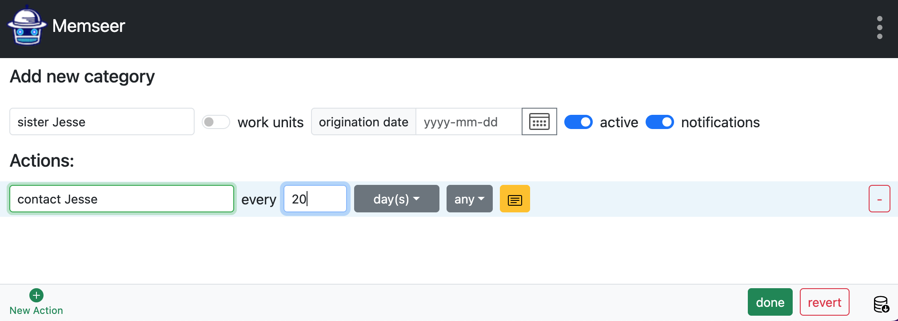
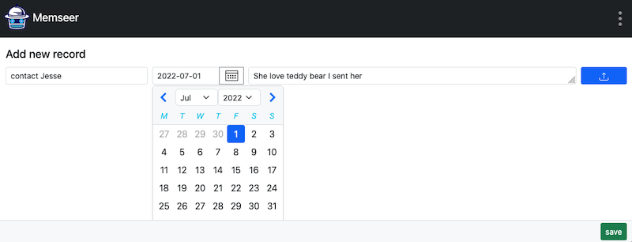
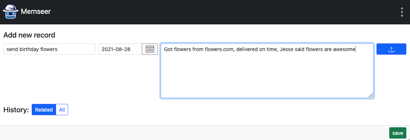
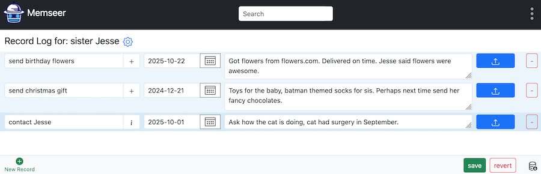

# Keep in touch

We all know—life is busy. Sometimes it flies by so quickly that it’s hard to remember when you last spoke with a friend, a family member, or a client—or what you talked about. You know it matters, and you know that if you recall just one detail, the whole conversation comes rushing back. How long has it been since you last connected? Did she get a new job or a promotion? What’s the new baby’s name? What gift did you send her last Christmas? We’ve all been there—but we don’t have to be anymore.
Navigate to [memseer.com](https://memseer.com){:target="_blank"}

Enter your email and password and complete sign in.

You will be redirected to the main dashboard. In the bottom left corner click on "New Category". Create a new category, give it a name (say sister Jesse), perhaps add an action: “contact Jesse” every 20 days. 

Click “done” and return to dashboard.

Click on “add last time the event took place”, pick the date you contacted Jesse last time, add notes and click “save”.

Back at the dashboard you can see next time you should contact Jesse. More over you can add event, let’s say you want to remember a flower shop that had great selection and delivered on time. Click “+ event”, give it a name (ex.: “send birthday flowers”), pick a date when you sent flowers, add notes and click “save”.

You can view all the events by click on “sister Jesse”.

This way you can go back in time and recall what’s important to you and always keep in touch with people you care about.
