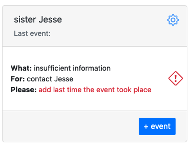
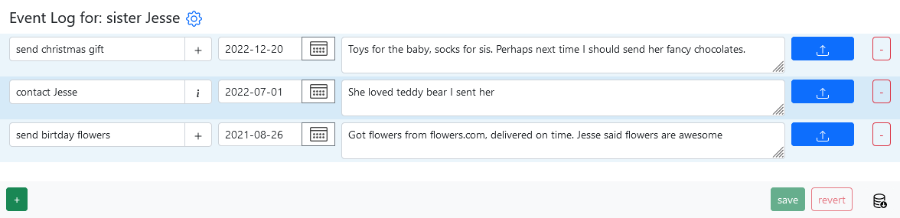

# Keep in touch

We all know - life is busy. Sometimes time flies so fast that it is hard to remember and recollect when was the last time you spoke to a friend or a family member or even a client, and what was the conversation about. You know it is important, you know if you just recall one piece, the entire conversation will come back to you. How long has it been since you’ve last spoken? Did she get a new job or a promotion? What is a name of new born? What present did I send her last Christmas? We all been there, but we don’t have to anymore.

Create new item, give it a name (say sister Jesse), perhaps add an action: “contact Jesse” every 20 days. 

Click “done” and return to dashboard.

Click on “add last time the event took place”, pick the date you contacted Jesse last time, add notes and click “save”.

Back at the dashboard and see next time you should contact Jesse. More over you can add event, let’s say you want to remember a flower shop that had great selection and delivered on time. Click “+ event”, give it a name (ex.: “send birthday flowers”), pick a date when you sent flowers, add notes and click “save”.

You can view all the events by click on “sister Jesse”

This way you can go back in time and recall what’s important to you and always keep in touch with people you care about.
