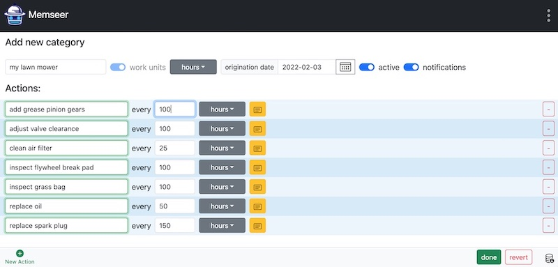
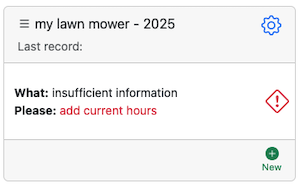
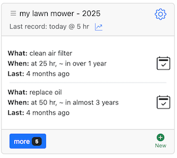
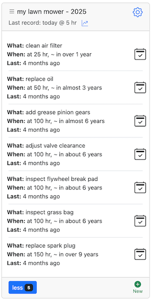

# Lawn mower

You have a gasoline lawn mower, and like everything else, it needs attention. For example, the air filter should be cleaned every 25 hours of use. The oil should be changed every 50 hours — or every 25 under heavy loads. Check the grass bag every 100 hours, and don't forget to replace the spark plug every 150 hours. In addition, the flywheel brake pad, valve clearance, and pinion gears should be checked, adjusted, and/or greased every 100 hours. It's a long list to remember, but we can use Memseer to keep track of every last item.

Navigate to [memseer.com](https://memseer.com){:target="_blank"}

Enter your email and password and complete sign in. 

You will be redirected to the main dashboard. In the bottom left corner click on "+ New Category". Create a new category, give it a name, call it "my lawn mower". Click "work units" and select "hours" from the dropdown. Let's choose the "origination date" as the manufacturing date, it can be approximated to a year if you don't remember when it was purchased. Now it is time to set the actions, click "+ New Action" under actions and populate the fields, so it reads as: "clean air filter every (repeats every) 25 hours". Let's keep adding new actions, click "+ New Action" for every new action:

* replace spark plug every 150 hours
* replace oil every 50 hours
* inspect grass bag every 100 hours
* inspect flywheel break pad every 100 hours
* clean air filter every 25 hours
* adjust valve clearance every 100 hours
* add grease pinion gears every 100 hours

Now that you've entered all the required actions, click Done. You'll return to the dashboard and see a new category — my lawn mower — with a warning that says: "insufficient information — add current hours." Memseer doesn't yet know how many hours you've put on your mower, and it needs that number to calculate what is due and when. 

Click on the warning sign and populate the field "hours" with current mileage so to speak, let's say you've done five hours so far, enter 5 and click "save", now back in the dashboard, you can see "my lawn mower" with a schedule of "what and when" something needs to be done.

When the time comes to complete an action — say, "Clean air filter" — simply click the check mark next to that action on the dashboard. Enter the current usage hours (for example, 25 hours), and Memseer will automatically recalculate all related actions to give you an updated countdown to the next one. You no longer need to keep handwritten notes or check them every time you're about to use the mower.

