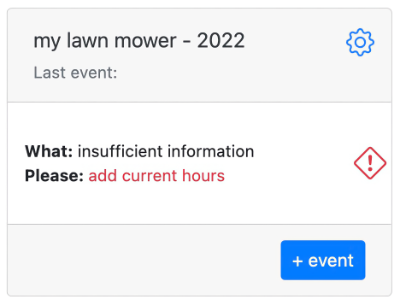
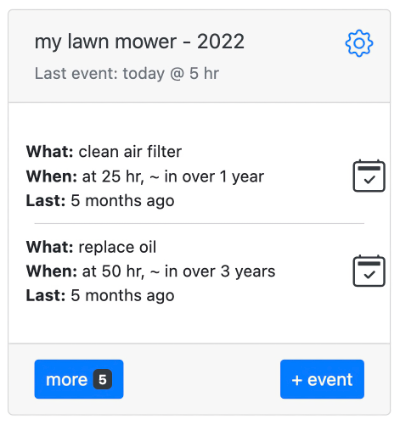
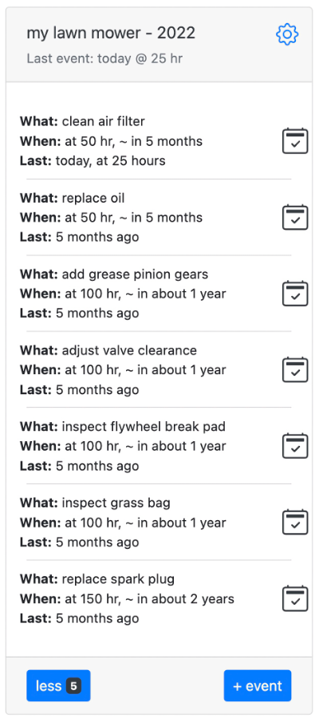

# Lawn mower

You have gasoline lawn mower, like everything else it needs attention. For example: air filter needs to be cleaned every 25 hours of use. Oil change should be
done every 50 hours of work or every 25 under heavy loads. Check grass bag every 100 hours of use and don’t forget to replace spark plug every 150 hours. In
addition flywheel break pad, valve clearance and pinion gears should be check, adjusted and/or greased every 100 hours. Kinda long list to remember, but we can
use Memseer to keep track of each and every point.

Navigate to [memseer.com](https://memseer.com){:target="_blank"}

Enter your email and password and complete sign in. 

Let’s add new item, give it a name “my lawn mower”, click “work units” and select “hours” from the dropdown. Let’s select “origination date” to manufacturing
date, it can be approximated to a year if you don’t remember when it was purchased. Now it is time to set actions, click “+” under actions and populate fields
so it reads as: “clean air filter every (repeats every) 25 hours”. Let’s keep adding new actions, click “+” for every new action:

* replace spark plug every 150 hours
* replace oil every 50 hours
* inspect grass bag every 100 hours
* inspect flywheel break pad every 100 hours
* clean air filter every 25 hours
* adjust valve clearance every 100 hours
* add grease pinion gears every 100 hours

Now that you entered all the required actions, click “done”. You will land back to dashboard and see new item “my lawn mower” with warning sign saying
“insufficient information… add current hours”. Memseer doesn’t know how many hours did you put on your lawn mower so far and it needs to know in order to
calculate when and what needs to be done. 

Click on warning sign and populate field “hours” with current milage so to speak, let’s say you done 5 hours so far,
enter 5 and click “save”, back to the dashboard and you can see “my lawn mower” with a schedule, “what and when” something needs to be done.

When time comes and you completed an action, lets say “clean air filter”, you can click on check mark across the action on the dashboard, enter current hours (
ex.: 25 hours) and Memseer will re-calculate all the actions in order to provide you with approximate count down when next action is required. You don’t have
keep hand-written notes and check it every time you are about to use the mower.

