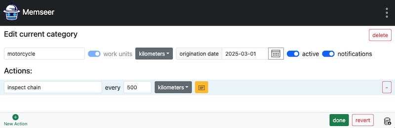
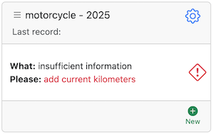
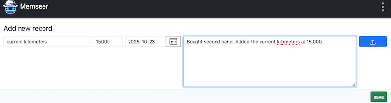
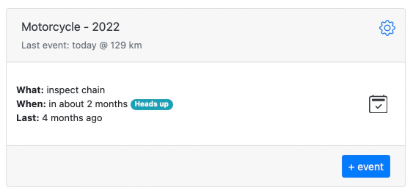

# Motorcycle

You have a motorcycle, and you want to inspect chain every 500 kilometers.

Navigate to [memseer.com](https://memseer.com){:target="_blank"}

Enter your email and password and complete sign in. 

You will be redirected to the main dashboard. In the bottom left corner click on "New Category". Go ahead and create the new category. Give it a name, check “work units” and select “kilometers”, don’t forget to select “origination date” in order to have proper scheduling. Now add new action by clicking “New Action +” sign, filling out: “inspect chain every 500 kilometers” and click “done”.

You’ll return to the dashboard, where you’ll see your category marked with a notice indicating that current mileage is required to calculate the schedule.

Don’t worry—this is a one-time action for new records. Click “add current kilometers” (or the red icon), enter the current reading, and click Save. Once you’re back on the dashboard, you’ll see an estimate of when the next chain inspection will be due.
You can also add more actions around this record. For example, if you want to inspect the chain every six months regardless of mileage, create a new action called “Inspect chain every 6 months.” Memseer will then remind you to perform the inspection half a year after the last one.

Additionally, if you’d like to inspect the chain more often during certain seasons—say, when conditions are tougher or usage is higher—you can add another action such as “Inspect chain every 2 months between August and November.”

