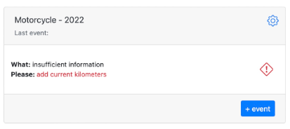

# Motorcycle

You have a motorcycle and you want to inspect chain every 500 kilometers.

Enter your email and password and complete sign in. 

Go ahead and create new item. Give it a name, check “work units” and select
“kilometers”, don’t forget to select “origination date” in order to have proper scheduling. Now add new action by clicking “+” sign, filling out: “inspect chain
every 500 kilometers” and click “done”.

You will be brought back to the dashboard and you will see your item with a notice that it requires current kilometers
in order to calculate schedule.

Don’t worry this is one time action for new items. Click “add current kilometers” or red sign, fill in kilometers (all other
fields are populated already) and click “save”. Back to the dashboard and you can see approximate time when you will have to inspect the chain. You can set more
actions around the event, let’s say regardless of milage you want to inspect the chain once every 6 month. You can create new action: “inspect chain every 6
months”. Now Memseer will remind you to inspect the chain half a year after last inspection.

In addition to that you might want to inspect the chain more frequently during a particular season (tough conditions or more frequent use), and so you can add
new action as such: “inspect chain every 2 month between August and November”.

