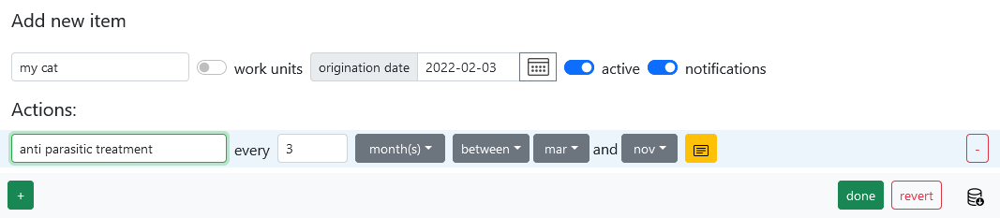
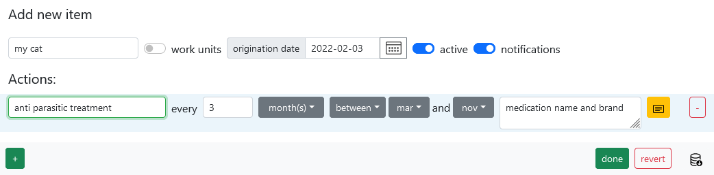
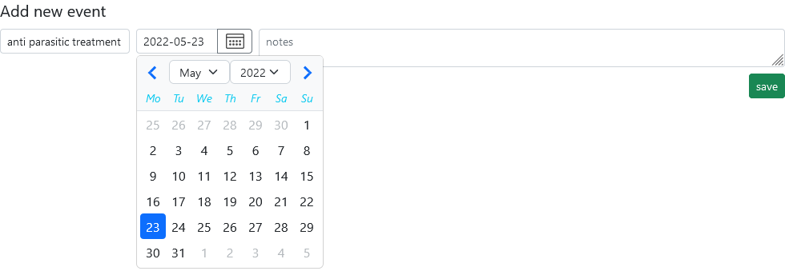
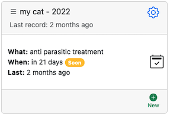

# My cat (or any other pet)

You got a cat, which needs to be looked after, periodically vaccinated, given anti-parasite medication and occasionally have its nails cut. Let’s create new
item, so we can effortlessly keep track of all important events. Give it a name and set origination date to the birthday of the cat. Next click “+” and add
actions such as “anti parasitic treatment”. Consult your veterinarian on the frequency of the treatment. In our example we will set frequency to every 3 month
and a period from March to November. 

One more thing, it would be nice to have medication name and brand written down, so you don’t have to remember or search
for it if you need to purchase it again. Click on yellow icon “notes” and add all the information. 

Now click “done” and you will be returned to the dashboard.
At this point you can start keeping a log of pet’s treatment. Click icon “checkbox” and enter a date when you gave your pet anti parasitic medication last time.

Don’t forget to click “save”, so Memseer remembers the information and calculates next date for the action.

