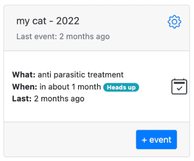

# My cat (or any other pet)

You got a cat, which needs to be looked after, periodically vaccinated, given antiparasitic medication and occasionally have its nails cut. Let's create new a category, so we can effortlessly keep track of all important records. Give it a name and set origination date to the birthday of the cat. Next click "+ New Action" and add "antiparasitic treatment". As per your veterinarian, add the frequency of the treatment. In our example we will set frequency to every 3 months, and the period from March to November.

Navigate to [memseer.com](https://memseer.com){:target="_blank"}

Enter your email and password and complete sign in. 

One more thing, it would be nice to have medication name and brand written down, so you don't have to remember or search
for it if you need to purchase it again. Click on the yellow icon "notes" and add all the information. 

Now click "done" and you will be returned to the dashboard.
At this point you can start keeping a log of your pet's treatment. Click the icon "checkbox" and enter a date when you gave your pet antiparasitic medication the last time.

Don't forget to click "save", so Memseer remembers the information and calculates next date for the action.

