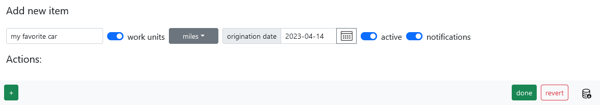
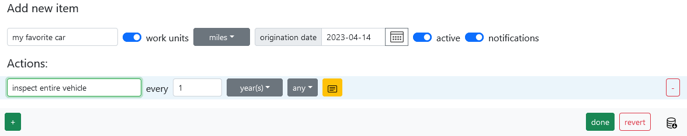

# Vehicle

You have a vehicle and would like to keep it in good shape, so let's put together a list of actions that are needed. In this example I'll use community provided actions from [General Modern Toyotas](https://docs.memseer.com/docs/shared.html). Please feel free to adjust maintenance intervals. 

Navigate to [memseer.com](https://memseer.com){:target="_blank"}

You will be redirected to the main dashboard. In the bottom left corner click on "+ New Category".

Let's add a new category from the dashboard:

Give it a name (for example: "my favorite car"), click "work units", select "miles" from the dropdown and select an origination date:

Now, it is time to add actions! Here is a list of actions that we will be adding:

* inspect entire vehicle every 1 year
* replace battery every 4 years
* replace brake fluid every 4 years
* replace coolant every 50000 miles
* replace coolant every 5 years
* replace diffs & transfer case fluid every 30000 miles
* replace oil & filter every 5000 miles
* replace oil & filter every 6 months
* replace power steering fluid every 50000 miles
* replace spark plugs every 120000 miles
* replace transmission fluid every 60000 miles
* rotate tires 15000 miles

Click on "+ New Action", under the "Actions" section: fill out the first action:

Continue adding actions, so you end up with following list:

Now click "done". You will be dropped back to the dashboard, and you will see your new category:

Note, there is a warning sign, indicating some missing information - which is normal because there is no current mileage provided for the vehicle. Let's add that information, click on the warning sign and fill out the current miles (for example the vehicle's done 200 miles this far):

Click "save" and you will be returned to the dashboard. Now there is no more missing information, all the actions are displayed properly:

**Please note:** at the current pace of 200 miles per day, you will hit you first oil change in less than one month. But perhaps you don't drive 200 miles per day and only done 200 miles this one time. No problem, just keep adding records to the category, Memseer will recalculate your daily average as more information arrives.

Let's say few days have gone by, we can add new record with the current mileage, let's click on "+ New Record".

Type "current miles" into name field and add current miles into miles field (let's say you are at 260 miles). Click save, next you will be dropped back to the dashboard with the recalculated schedule:

Now your oil service is calculated to be in three months. As you keep driving and adding more records to the category, Memseer will be constantly recalculating and making sure that maintenance is scheduled at the correct time.