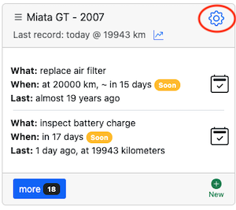
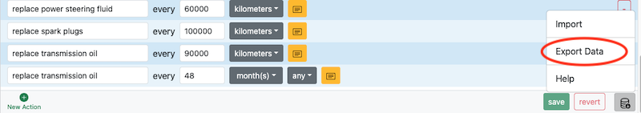
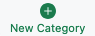
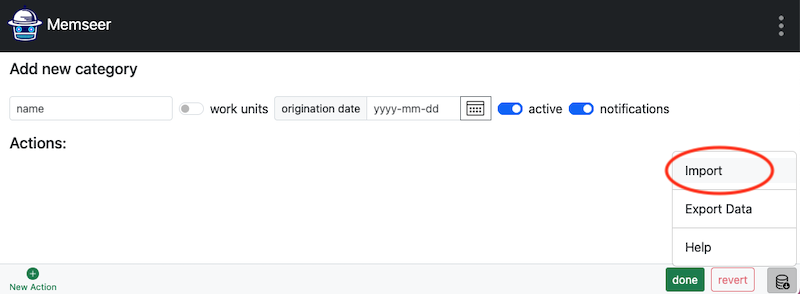
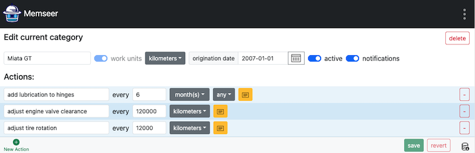
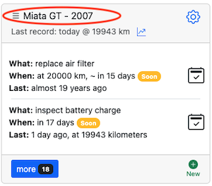
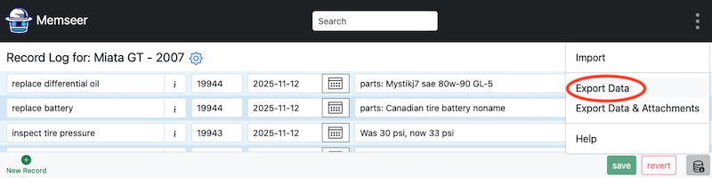
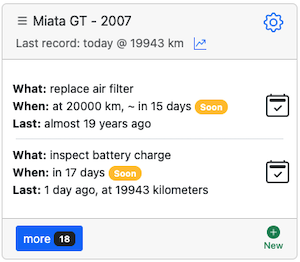
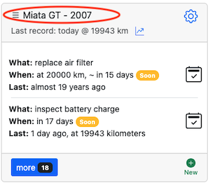
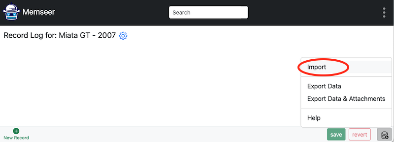

# Data management
{: .no_toc }

How to import & export data
{: .fs-6 .fw-300 }
---

Your data split into 2 parts: [Category](../guides/overview.md#category) (includes actions) and [Records](../guides/overview.md#records). Both parts are independent of each other and can be imported/exported separately.

---

- TOC
{:toc}

--- 

## Category

### Export

In order to export your category, go to the dashboard, find the desired title and click the edit category (gear image).

Next, scroll all the way to the bottom of the page and click on the database icon on the bottom right hand corner, click on "Export Data".

Click "Export Data" and the category file will be saved to your device under the category's name, for example:\
`Miata GT.json`

### Import

In order to import a brand-new category, go to the main dashboard, scroll to the bottom and click on "New Category".

Next, click on "Import".

Select an import file (example: `Miata GT.json`) and in a second you will see the populated category.

---

## Records

### Export

When exporting, you have two options: export records only, or export records with file attachments. Let's first discuss how to export records:

#### Export Records
To export records, navigate to the dashboard and locate the desired category. Click on the category name.

Next, scroll to the bottom of the page and find the "Export Data" button on the right side.

Click "Export Data". The record file will be saved to your device under the category's name, for example:
`Miata GT.csv`

#### Exporting Records with Attachments

To export records with attachments, go to the dashboard, find the desired category, and click on the category name.

Then, scroll to the bottom of the page and locate the "Export Data & Attachments" button on the right side.

Click "Export Data & Attachments". A zip file will be saved to your device under the category’s title, for example:
`Miata GT.zip`. This archive will contain `Miata GT.csv` along with all attached files.

### Import

In order to import records, go to dashboard and click on the category's name.

Note: the category might NOT have a "Last record:" and might have a bunch of "Late" actions. This is normal if there are no records.

Click on category's name.

On the bottom right click "Import", select file (example: `Miata GT.json`) and in a second you will see the populated records.

