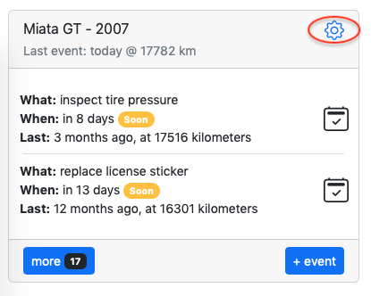
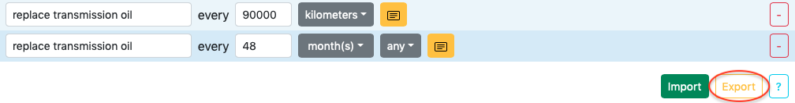
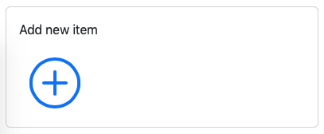
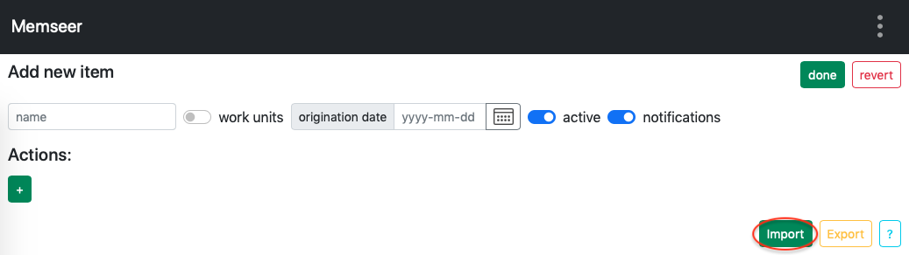
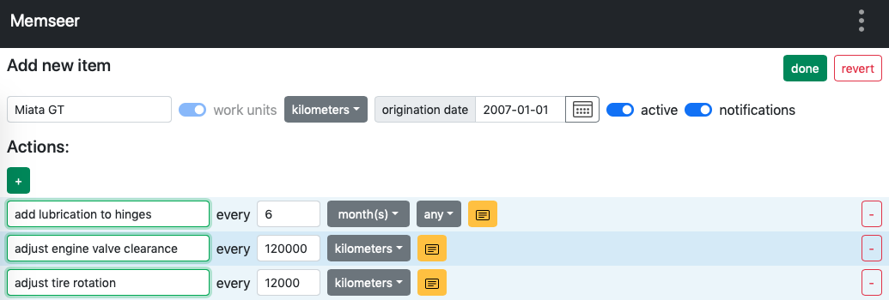
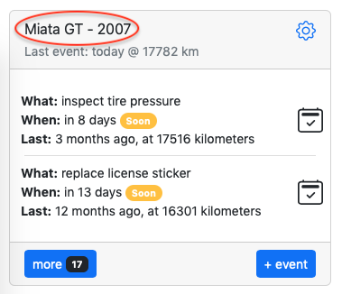
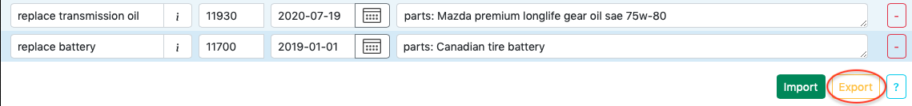
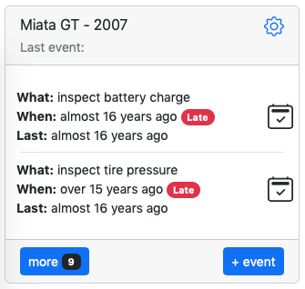
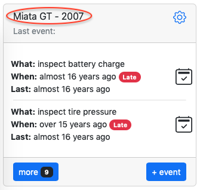
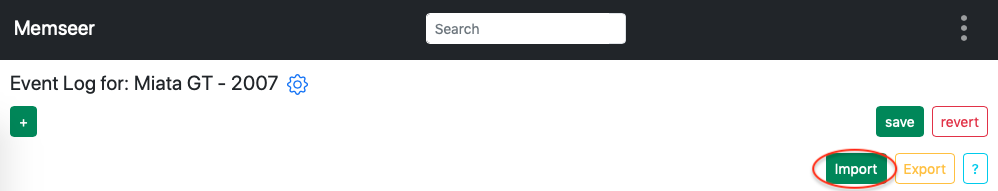

# Data management
{: .no_toc }

---

Your data split into 2 parts: [Item](../guides/overview.md#item) (includes actions) and [Events](../guides/overview.md#events). Both parts are independent of each other and can be imported/exported separately. 

---

{:toc}

--- 

## Item

### Export

In order to export your item, go to dashboard, find desired item and click edit item (gear image).

Next scroll all the way to the bottom of the page and find "Export" button on the right side.

Click "Export" and item file will be saved to your device under item's name, for example:\
`Miata GT.json`

### Import

In order to import a new item, go to dashboard, scroll to the bottom and click on "Add new item".

Next, click on "Import".

Select an import file (example: `Miata GT.json`) and in a second you will see populated item

---

## Events

### Export

In order to export events, go to dashboard, find desired item and click on the item name.

Next scroll all the way to the bottom of the page and find "Export" button on the right side.

Click "Export" and events file will be saved to your device under item's name, for example:\
`Miata GT.csv`

### Import

In order to import events, go to dashboard and click on the item's name.

Note: the item does NOT have "Last event:" and has a bunch of "Late" actions. This is normal since there are no events.

Click on item's name.

On the bottom right click "Import", select file (example: `Miata GT.csv`) and in a second you will see populated events.

