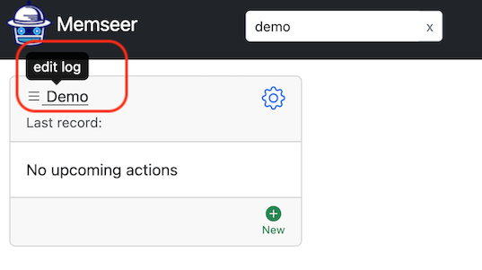
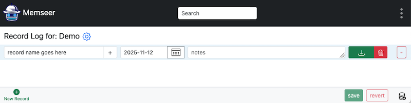

# Files
{: .no_toc }

How to manage files
{: .fs-6 .fw-300 }
---

Memseer allows you to attach files to records. This is useful whenever you want to keep a document, receipt, medical record, photo, or some other important file in your records. Files are not limited to documents; you can store archives, binaries, and whatever else you need, as long as it is a single file.

---

## How to

Navigate to a category and click on the name of the category.

Next, click on “New Record” to create a new record, give it a name.

Click on the upload button and select a file you would like to attach. Note: once the file is selected, you will be able to remove it in case you don't want to upload it.

Now click on save, and the file will be uploaded and available for download (or removal).

**Note:** if you want to remove a file, please click on the "trash button" and then click "save." If you don't save, the file will not be removed.
          
---

## Single File per Record

Currently, Memseer supports one file per one record — you can't have multiple files uploaded for the same record. If you have a need to upload multiple files, you have a couple of choices:

1. Collect and archive all the files into a single archive file, such as zip, and upload the file.
2. Create multiple records and upload one file to each record.

If you have questions, suggestions, and/or feature requests, please give us your [feedback](../feedback.md).

