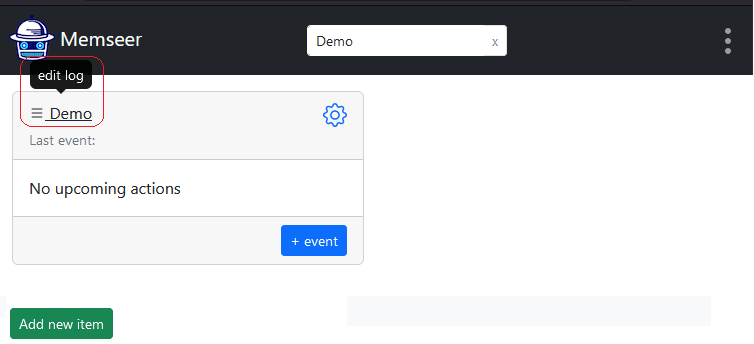
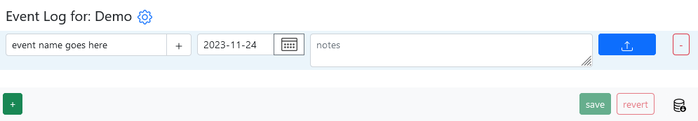
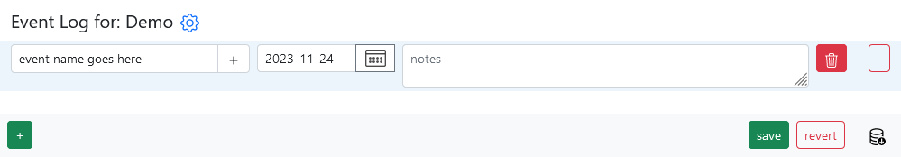
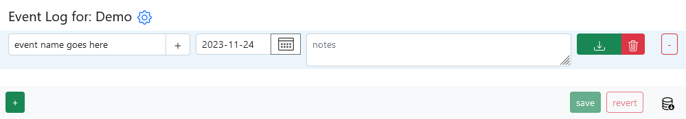

# Files
{: .no_toc }

How to manage files
{: .fs-6 .fw-300 }
---

Memseer allows you to attach files to events. This is useful whenever you want to keep a document, receipt, photo, or some other important file in your records. Files are not limited to documents; you can store archives, binaries, and whatever else you need, as long as it is a single file.

---

## How to

Navigate to an item and click on the name of the item.

Next, create a new event, give it a name, and save it.

Once the event is saved, you will see the upload button.

Click on the upload button and select a file you would like to attach. Note: once the file is selected, you will be able to remove it in case you don't want to upload it.

Now click on save, and the file will be uploaded and available for download (or removal).

**Note:** if you want to remove a file, please click on the "trash button" and then click "save." If you don't save, the file will not be removed.
          
---

## Single File per Event

Currently, Memseer supports one file per one event — you can't have multiple files uploaded for the same event. If you have a need to upload multiple files, you have a couple of choices:

1. Collect and archive all the files into a single archive file, such as zip, and upload the file.
2. Create multiple events and upload one file to each event.

If you have questions, suggestions, and/or feature requests, please give us your [feedback](../feedback.md).

