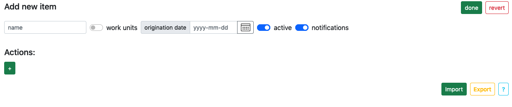
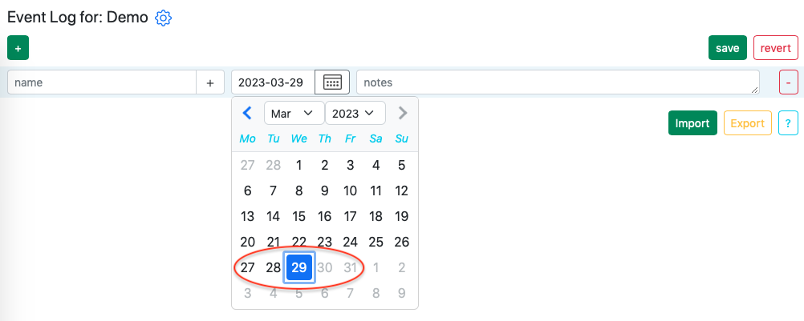
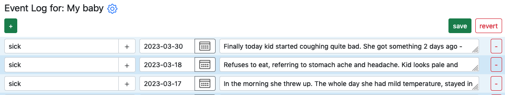
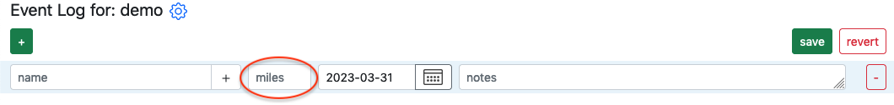
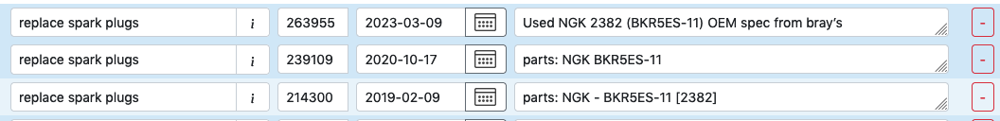
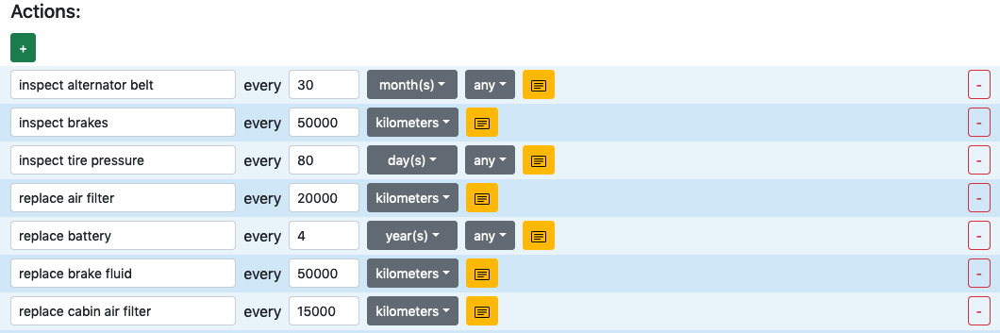
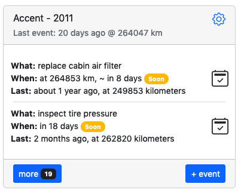

# Item, Events & Actions

What is Item, Events & Actions?
{: .fs-6 .fw-300 }
---

# Item

Item is something you want to keep an eye on and/or take care of. It can be a vehicle, device, personal health, special days, holiday and more. Each item contains [events](#events) - in order to keep a log and [actions](#actions) to be performed if so desired.

Item has several fields, which are optional.

**[work units](#work-units)** can be enabled if you need to keep track of thing with kilometers, miles or hours of operation, such as vehicles, airplanes or even treadmills - [see example](#work-units)

**origination date** - is a date when the item was manufactured/created or simply started working.

**active** - enables/disables calculation of schedule when [actions](#actions) are present.

**notifications** - enables/disables notifications (via email) of upcoming actions to be completed.

---

# Events

An event is a simple record of what took place. Every event has a name, date, notes and sometimes work units (we will talk about it later). You can create as many events as you want to record different type of event that took place.

**Note:** Date selection is limited to present or past dates, because this is an event, that took place already.

Event names are given in the present tense, for example: "replace air filter". There is no restriction on how you want to name an event; however we recommend sticking the present tense.

Event notes can contain anything you want to make note of. You can make a note of weather condition, part number, reasons for making certain decisions, the latest stock price and so on. I make extensive use of it when my kid gets sick. I record my observations in case I need to see a doctor at a later point, so I can provide as accurate information as possible.

### Work units

Work units is an optional field for an event that appears whenever the item has work units enabled. Work units field comes with three options: kilometers, miles or hours. Here is an example:

Work units field comes handy when you are dealing with machinery that needs maintenance based on mileage rather than time passage. For example, a vehicle needs spark plugs replaced after certain amount of miles.

---

# Actions

An action is a record that indicates conditions when something should be done. Each action has a name, condition and notes. Let's take a look at vehicle's actions:

In the example we can see various actions that should be performed at certain conditions, based on time and/or kilometers. How does an action determines when the condition is met? The action looks into [events](#events), finds the same-named event, and calculates date when the action should take place.

Effectively actions are like rules or specifications that should be applied to an [item](#item).  

