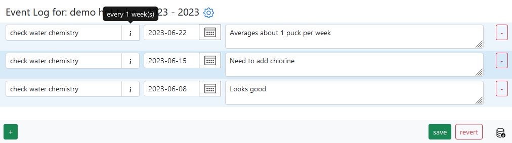

# Overview
{: .no_toc }
What is Dashboard, Category, Records & Actions?
{: .fs-6 .fw-300 }

  

    Table of contents
  

  {: .text-delta }
- TOC
{:toc}

---

# Dashboard

The Dashboard is the central hub of Memseer, where you can view all your categories and schedules in priority order.

Each card on the Dashboard represents a category or a subject. Let's take a closer look at the information displayed on a single card:

1. The name of the category and the year it was originated. By clicking the category name, you will navigate to all the associated records / record log.
2. The last time a record was added, including the mileage (if applicable).
3. The category's settings.
4. The upcoming action that needs to be performed.
5. A "quick complete" button for the action.
6. An option to expand the card to see all scheduled actions sorted by upcoming priority.
7. An option to add a record to the category.

---

# Category

Category is something you want to keep an eye on and/or take care of. It can be a vehicle, device, personal health, special days, holiday and more. Each category contains [records](#records) - in order to keep a log and [actions](#actions) to be performed if so desired.

Category has several fields, which are optional.

**[work units](#work-units)** can be enabled if you need to keep track of thing with kilometers, miles or hours of operation, such as vehicles, airplanes or even treadmills - [see example](#work-units)

**origination date** - is a date when the category was manufactured/created/started working or simply when we want to start keeping track.

**active** - enables/disables calculation of the schedule when [actions](#actions) are present.

**notifications** - enables/disables notifications (via email) of upcoming actions to be completed.

---

# Records

A record is a recollection of something that took place in time. Every record has a name, date, notes and sometimes work units (we will talk about it later). You can create as many records as you want.

**Note:** Date selection is limited to present or past dates, because this is a record of past events.

Record names are given in the present tense, as they are based on an action. For example: "replace air filter". There is no restriction on how you want to name a record; however, we recommend sticking to the present tense.

Record notes can contain anything you want to make note of. You can make a note of weather condition, part number, invoice, reasons for making certain decisions, the latest stock price and so on. I make extensive use of it when my kid gets sick. I record my observations in case I need to see a doctor at a later point, so I can provide as accurate information as possible.

## Work units

Work units is an optional field for the record that appears whenever the category has work units enabled. Work units field comes with three options: kilometers, miles or hours. Here is an example:

The Work Units field is particularly useful when maintaining machinery that requires service based on usage metrics or based on mileage or kilometers rather than time passage. For example, a vehicle needs spark plugs replaced after a certain number of miles.

---

# Actions

An action is a record that indicates conditions when something should be done. Each action has a name, condition and notes. Let's take a look at vehicle's actions:

In the example we can see various actions that should be performed at certain conditions, based on time and/or kilometers. How does an action determine when the condition is met? The action looks into [records](#records), finds the same-named record, and calculates date when the action should take place.

Effectively actions are like rules or specifications that should be applied to a [category](#category).

## Action types:

There are several action types available to accommodate complex requirements. Let’s start with the basic types:

- Every 5 days
- Every 4 weeks
- Every 3 months
- Every 2 years
- Every 1000 miles

Check out this [vehicle example](../examples/vehicle.md). 

Next, we can add more conditions:

- Every 5 days between January and February
- Every 4 weeks between April and October
- Every 3 months between March and December

These actions with specific conditions apply during certain periods, allowing you to schedule seasonal tasks that need to be done only within those time frames. For example:

`Antiparasitic medication every 3 months between mar and nov`

This example illustrates [cat care](../examples/my_cat.md), where the cat needs to take medication every 3 months during the outdoor season.

Now, let’s look at more specific conditions:

- Every 4 weeks on Monday
- Every 3 months on 2nd
- Every 2 years on February 3rd

These actions allow for a tight schedule and precise tracking. For example, the water bill might arrive every 3 months:

`Water bill every 3 months on 15th`

Or property taxes might be due every year on February 20th:

`Property tax every 1 year on feb 20th`

Create the record, click on "+ New Record".

Create the Action for the record.

## Creating action(s)

There are two ways to create actions: directly, by navigating to "Category & Actions" and adding new actions, or by creating actions from existing records.

The first method involves navigating to "Edit Category & Actions" select and click on “New action”. Here's an image that illustrates this process:

The second method is useful when you already have records and want to create actions based on them. To do this, navigate to the record log and identify the record that requires an action. For example, let's say we have a record called "check water chemistry," which occurs every week based on the dates between records.

To create an action from this record, click on the "+ New Action" sign. You will be redirected to the "Category & Actions" page, where the newly created action will be highlighted:

Next, you need to set the unit to "1" and select "weeks." Leave everything else as default and click "Done":

Congratulations! You have successfully created an action. You can view it on the dashboard and also find it under the 'i' icon in the top-right corner of the record name:

