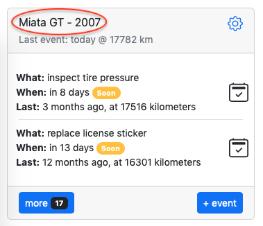

# Export

---

Your data split into 2 parts:
- [Item](#item)
- [Events](#events)

---

## Item

Item contains general information such as name of the item, date of origin, unit of work, notification setting and more. Item also contains actions, which represent something that needs to be done at certain intervals or milestones.

In order to export your item, go to dashboard, find desired item and click edit item (gear image).

Next scroll all the way to the bottom of the page and find "Export" button on the right side.

Click "Export" and item file will be saved to your device under item's name, for example:\
`Miata GT.json` 

---

## Events

Events contain information about something that already took place, including name, date, notes and optionally unit of work (miles/kilometers/hour). Events are exported in CSV format for ease of use, for example if you want to import events into Excel or database.

In order to export events, go to dashboard, find desired item and click on the item name.

Next scroll all the way to the bottom of the page and find "Export" button on the right side.

Click "Export" and events file will be saved to your device under item's name, for example:\
`Miata GT.csv`
