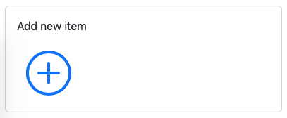
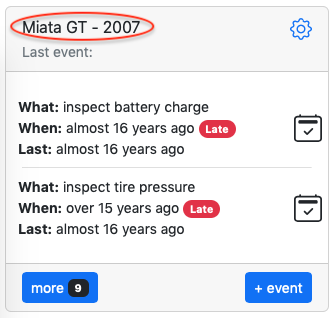

# Import

---

There are 2 types of data imports:
- [Item](#item)
- [Events](#events)

_Note: both imports are independent of each other and can be used separately of each other._

---

## Item

Item contains general information such as name of the item, date of origin, unit of work, notification setting and more. Item also contains actions, which represent something that needs to be done at certain intervals or milestones.

In order to import a new item, go to dashboard, scroll to the bottom and click on "Add new item".

Next, click on "Import".

Select an import file (example: `Miata GT.json`) and in a second you will see populated item

---

## Events

Events contain history of what has happened to an item. Once you have an item, you can import events.

Go to dashboard and click on the item's name.

Note: the item does NOT have "Last event:" and has a bunch of "Late" actions. This is normal since there are no events.

Click on item's name.

On the bottom right click "Import", select file (example: `Miata GT.csv`) and in a second you will see populated events.

