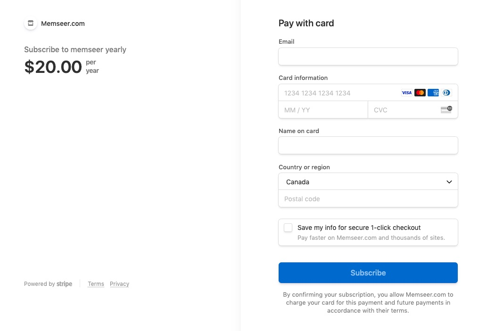
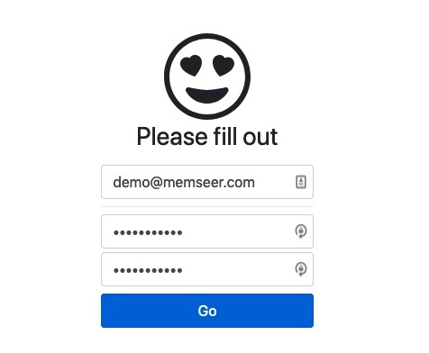

# How to sign up

How to create a Memseer account 
{: .fs-6 .fw-300 }
---

On the [memseer.com](https://memseer.com) page, click “Sign up”.\
Choose subscription model: $2 per month or $20 per year, both subscriptions have the same set
of features.\
Next, you will be sent to the checkout page, where you can fill out your payment information.

Once you’ve completed checkout and clicked the “Subscribe” button, you will be redirected to a sign up page, where you need to fill out simple form: email &
password.

Please note, the email will be used for email notifications and in case the need to restore or reset your password arises.\
The password used must be at least 10 characters long with at least 1 uppercase, 1 lowercase and 1 digit.\
Click “Go” and registration is complete, now you can sign in!

