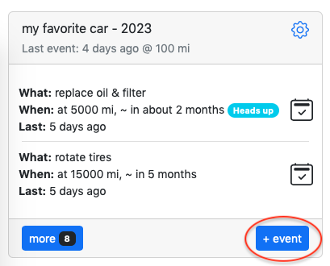

# Vehicle

You have a vehicle and would like to keep it in a good shape, so lets put together list of actions that are needed. In this example I'll use community provided actions from [General Modern Toyotas](https://docs.memseer.com/docs/guides/import_export/shared.html). Please feel free to adjust maintenance intervals. 

Let's add new item from dashboard:

Give it a name (for example: "my favorite car"), click "work units", select "miles" from the dropdown and select origination date:

Now it is time to add actions! Here is a list of actions that we will be adding:

* inspect entire vehicle every 1 year
* replace battery every 4 years
* replace brake fluid every 4 years
* replace coolant every 50000 miles
* replace coolant every 5 years
* replace diffs & transfer case fluid every 30000 miles
* replace oil & filter every 5000 miles
* replace oil & filter every 6 months
* replace power steering fluid every 50000 miles
* replace spark plugs every 120000 miles
* replace transmission fluid every 60000 miles
* rotate tires 15000 miles

Click on "+" under "Actions" section and fill out first action:

Continue adding actions, so you end up with following list:

Now click "done". You will be dropped back to dashboard, and you will see your new item:

Note, there is a warning sign, indicating some missing information - which is normal because there is no current milage provided for the vehicle. Let's add that information, click on the warning sign and fill out current miles (for example vehicle done 100 miles this far):

Click "save" and you will be returned to the dashboard. Now there is no more missing information, all the actions are displayed properly:

**Please note:** at the current pace of 100 miles per day, you will hit you first oil change in about 2 months. But perhaps you don't drive 100 miles per day and only done 100 miles this one time. No problem, just keep adding events to the item, Memseer will recalculate your daily average as more information arrives.

Lets say few days gone by, we can add new event with current milage, let's click on "+ event"

Type "current miles" into name field and add current miles into miles field (lets say you are at 110 miles), click save and you will be dropped back to the dashboard with recalculated schedule:

Now your oil service is calculated to be in 6 months. As you keep driving and adding more events to the item, Memseer will be constantly recalculating and making sure that maintenance is scheduled at the correct time.
