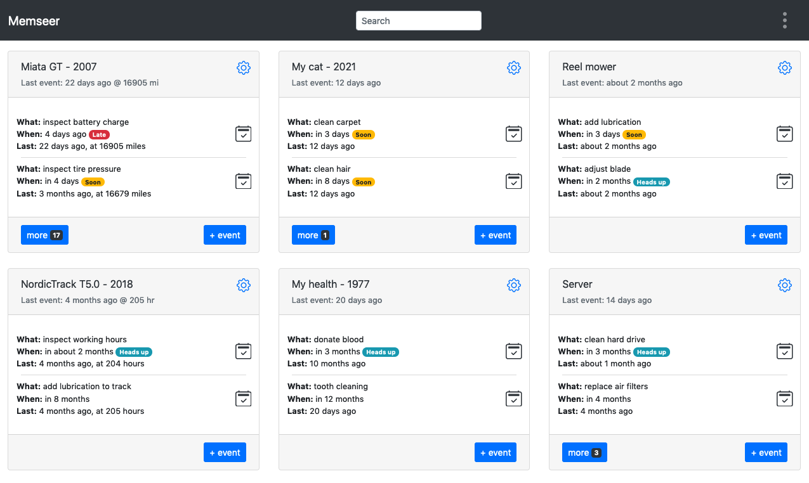

# Memseer

A new way to organize
{: .fs-6 .fw-300 }
---

### Memseer keeps track of your things by remembering events and associated actions.

At the core there are two functionalities: event creation - a record of what happened and actions associated to an event. Action describes when an event should
be performed.\
`Example: event - donate blood, action - repeat every 6 month.`

**Is Memseer a calendar?** No it is not. You can’t create meetings or appointments. Memseer doesn’t have hard dates or time allocations. If you miss a task, Memseer
will not forget about it, unlike calendar.

**Is Memseer a todo list?** Not exactly, while memseer can calculate when a task should be done, it doesn’t allow manual creation of one-off todo item. Memseer best
suited for repeatable tasks.

**Is Memseer a reminder?** Not exactly, you can’t create reminders manually, however Memseer does remind you about repeatable tasks that should be accomplished.

### Why Memseer:
- Easy planning: everything that needs attention at a glance
- Simple: record events, set actions, see dashboard
- Never lose important information: record, forget and look it up when needed
- Reoccurring events annoying: set actions, see schedule and plan around it
- True data ownership: your data, import it, export it, take it anywhere you want
- You are not the product: no tracker, no partners, no brokers, no ads
- Anywhere: one site, email notification, mobile support

